# Anime Recommender System
### Anime Recommender System with Content-based and Collaborative Filtering

<br/>

<p align="center">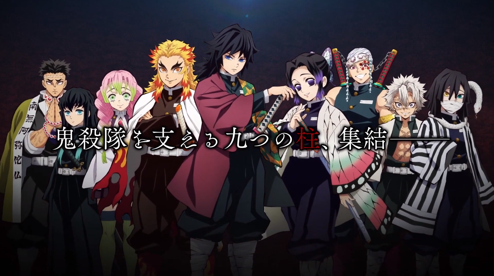</p>

<br/>

## About the project

Anime (アニメ) was a Japanese term of 'Animation' which was a term mentioned to represent Japanese Animation. Anime has a style and characteristic making it unique and stand out from other animation type. Nowadays, Anime has been well-known has plenty large fanbase and fans from all over the world, including me myself.

With increasing number of Anime shows, there was lots titles available to watch. Sometimes, It confusing to choose what to watch and find anime suits our liking. With that, I tried to build myself an Anime Recommender System to help me and anime fans to found more anime to watch, that suits to our liking. Here I build recommender systems with content and collaborative filtering.

<br/>

### **Objective**
Data Exploration
- How rating distributed?
- What the most popular anime?
- What the most rated anime?

Model Building:
- Content-based filtering recommender demo.
- Collaborative filtering recommender demo.

<br/>

***jupyter notebook seperated to 4 files:***

**1. [Data Cleaning](customer_churn.ipynb)**

**2. [EDA](customer_churn.ipynb)**

**3. [Content-based Filtering Recommender](customer_churn.ipynb)**

**4. [Collaborative Filtering Recommender](customer_churn.ipynb)**

<br/>

## Folder Structure
```
.
├── img/                                : contain image used
|   └── src.txt                         : link source for image
└── plot/                               : contain image file of plot 
└── .gitignore
└── 1_data_cleaning.ipynb               : notebook for data cleaning
└── 2_EDA.ipynb                         : notebook for EDA
└── 3_Content_based_filtering.ipynb     : building + model demo of content-based filtering recommender
└── README.md
```

<br/>

## TABLE OF CONTENT
- [THE DATASET](#the-dataset)
- [EXPLORATORY DATA ANALYSIS (EDA)](#exploratory-data-analysis)
- [MODEL RESULT AND CONCLUSION](#model-result-and-conclusion)

<br/>

## **THE DATASET**
Dataset used sourced from myanimelist.net (MAL), which was one of the biggest anime and manga community site where user can list, rate, and open discussion to anime and manga. 

Dataset scrapped and uploaded on kaggle by Hernan Valdivieso: https://www.kaggle.com/hernan4444/anime-recommendation-database-2020

The dataset uploaded consisted of 5 csv file. However, I decided to only use 3 csv files ('anime_with_synopsis.csv', 'anime.csv', 'rating_complete.csv') I'm not using 'animelist.csv' due to the size of the data and computation limitation, and I'm not using 'watching_status.csv' either as this data only used to encode watching status on 'animelist.csv'.

And to mention, 'rating_complete.csv' is a subset of 'animelist.csv', where user have completed the anime and gave rating to an Anime, meanwhile 'anime_list.csv' also contain user that not given a rate, or still watch/drop the anime. This makes 'rating_complete.csv' was good enough to be used for content and collaborative based filtering recommender systems.

### ***'anime_with_synopsis'***
'anime_with_synopsis' is dataset representing anime and its properties. It contain 5 column/features:
- MAL_ID    : Unique anime identifier index given by MAL 
- Name      : Anime titles
- Score     : Anime rating counts from user given rating
- Genres    : Comma seperated list of Anime's genres
- Synopsis  : String with the synopsis of the anime

### ***'anime_df'***
'anime_df' is dataset representing anime and its properties. It contain 35 column/features, summed up:
- MAL_ID    : Unique anime identifier index given by MAL 
- Name      : Anime titles
- Score     : Anime rating counts from user given rating
- Genres    : Comma seperated list of genre of anime
- English name  : Anime titles in english
- Japanese name : Anime titles in japanese
- Type      : Anime Type (TV, movie, OVA)
- Episodes  : Episodes counts
- Aired     : Broadcast date
- Premiered : Season which the anime broadcasted
- Producers : Comma seperated list of anime producers
- Licensors : Comma seperated list of Licensor/Broadcast owner of the anime
- Studios   : Comma seperated list of Studios that produce the anime
- Source    : Anime adaptation source (manga, light novel, etc)
- Duration  : Duration of anime per episode
- Rating    : Age rating (PG, G, etc)
- Ranked    : Rank Position based on Score
- Popularity: Popularity position based in the the number of users who have added the anime to their list.
- Members   : Number of community member of the anime
- Favorites : Number of user who add this anime to their favorites
- (anime watching status) number of users with status of: Watching, On-Hold, Dropped, Plan to watch
- (score) number of user who give the anime scores from 1 to 10

### ***'rating_df'***
'rating_df' represent rating given by user to anime. It contain 3 column/features:
- user_id   : Unique identifier for each user given by MAL
- anime_id  : Anime's id which user given rated
- rating    : rating of anime given by user (scale of 1-10)

<br/>

*the dataset then processed and exported to 4 csv to be used on the next file and notebook:*
- anime_full    : full anime df
- anime_subset  : anime with selected feature
- anime_titles  : anime titles and id
- rating_df     : rating 

<br/>

## **EXPLORATORY DATA ANALYSIS**
*check jupyter notebook for complete EDA and code [here](2_EDA.ipynb)*

Objective: 
- How rating distributed?
- What the most popular anime?
- What the most rated anime?

<br/>

### **Anime 'Score' distribution**
Score is Anime rating counts from user given rating. 
### Q: How Score vary on anime titles? whats the average of the Score?
<p align="center">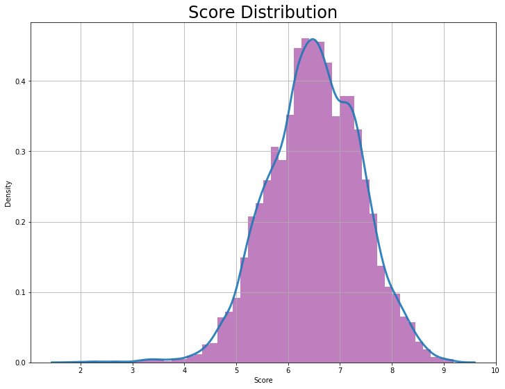</p>
'Score' has Normal/Gaussian Distribution, averaged on 6.5.
<br/>
<br/>

### **Genres**
Genres is Comma seperated list of genre of anime, which mean one anime titles may have more than one genres. Here each list was split to count individual genre counts.
### Q: How many Genres are there? Whats the most popular Genres?
<p align="center">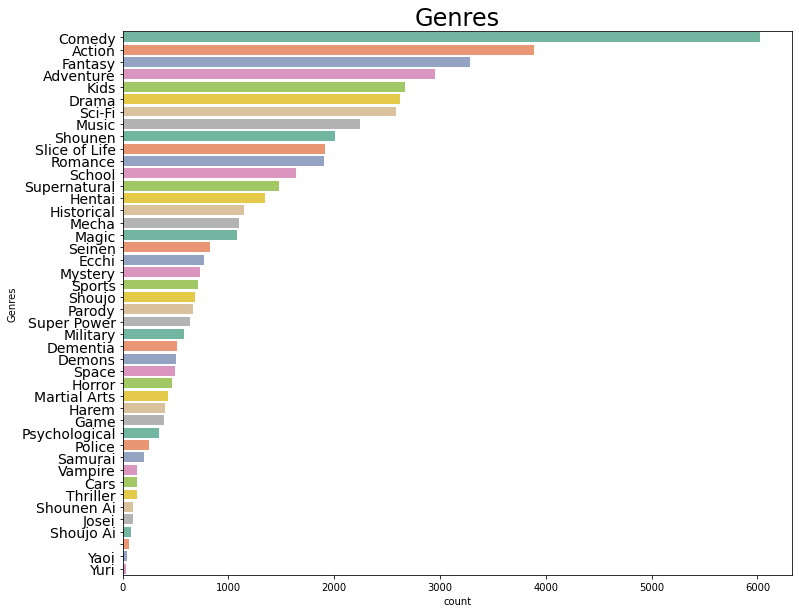</p>
there are 43 Genres with Comedy, Action, and Fantasy being the most popular Genre.

<br/>
<br/>

### **Anime's Type**
Type represent the type of Anime. Anime has various show type, for example, TV (Anime that broadcast on TV(series)), Movie (1 episodes, usualy broadcast on cinemas), etc.
### Q: What is the most popular type?
<p align="center">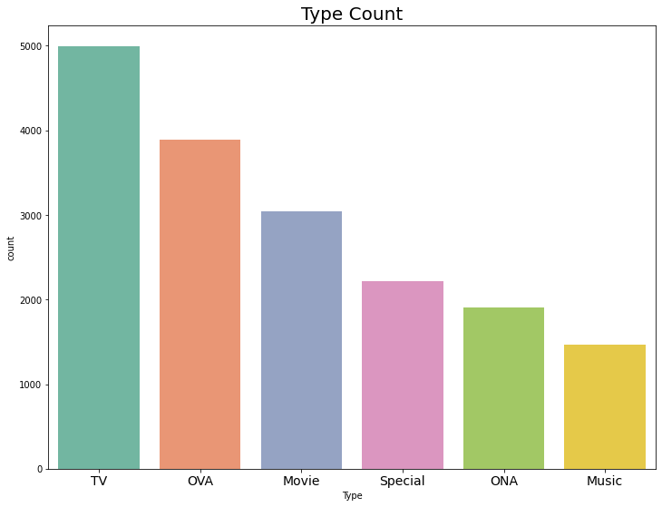</p>
The most popular Type was TV, and the least popular Type was Music.

Here are some description for each type:
- TV        : Anime series, broadcasted on TV weekly and seasonal
- OVA       : OVA Stands for Original Video Animation. Usually not broadcasted and sold as a single product, it usually a bonus show for a TV Anime.
- Movie     : 1 episodes Anime, broadcasted on Cinema
- Special   : Similar with OVA, but its possible to be distributed on TV, and usually with longer duration.
- ONA       : ONA Stands for Original Net Animation. Its similar to OVA, but its distributed on Web platform such as Youtube.
- Music     : Produced Anime Music Video

<br/>
<br/>

### **Episodes Count**
Episodes counts of anime titles, Movie counted as one episodes anime. 
### Q: How Anime Episodes counts distributed?
<p align="center">
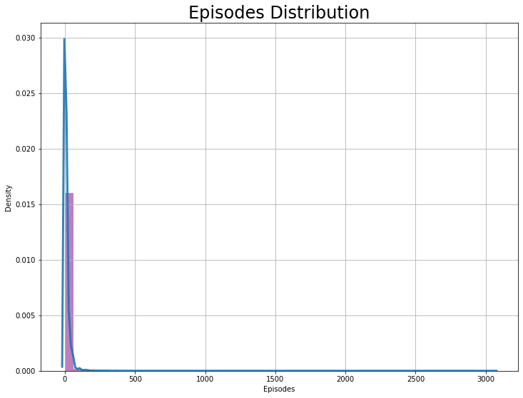
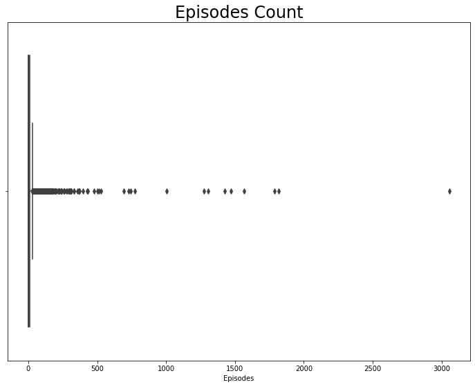
</p>
There are some anime running in really long time. Meanwhile most titles has less than 100 episodes.
<p align="center">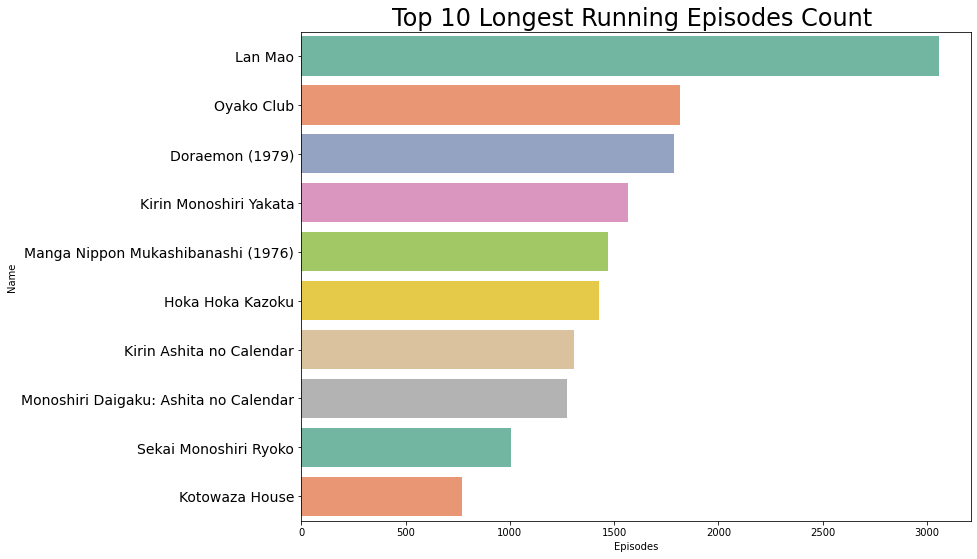</p>
Lets see detailed episode distribution for most titles (less episode counts)
<p align="center">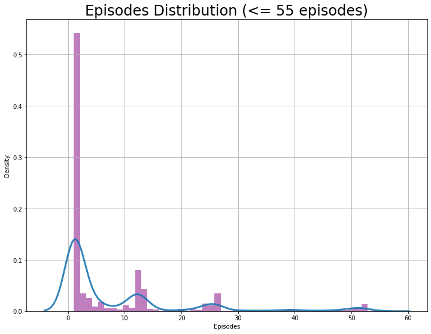</p>
most anime episodes ranged from 0-55, and as we can see, it’s not distributed normally. Let’s analyse this.

- Anime with the most episode count is one episode. This due to anime with types of movie only have one episode. OVA, ONA, and music usually only have one episode as well. 

- The next biggest episodes count is 12 and 13 This due to anime series usually shown per season, in which was 4 month or 12 weeks, and anime TV was broadcasted weekly so one season usually consist of 12-13 episodes. 

- There are also big number of episodes count on 24, 25, and 26. This due to longer series that last 2 seasons with 24-26 episodes.
<br/>
<br/>

### **Producers, Licensors, and Studios**
- Producers consist of comma seperated list of anime producers. 
- Licensors consist of comma seperated list of anime licensors (broadcast license owner). 
- Studios consist of comma seperated list of anime studio (studio that produces the anime). 
### Q: How Many Producers, Licensors, and Studios are there?
    ///////////////////////
    Producers: 
    []                  7794
    [NHK]                623
    [Pink Pineapple]     184
    [Sanrio]             160
    [Bandai Visual]      117    
    ...                                           
    Name: Producers, Length: 3783, dtype: int64
    ///////////////////////

    ///////////////////////
    Licensors: 
    []                 13616
    [Funimation]         883
    [Sentai Filmworks]   652
    [Media Blasters]     206
    [Discotek Media]     194
    ...                                        
    Name: Licensors, Length: 231, dtype: int64
    ///////////////////////

    ///////////////////////
    Studios: 
    []                  7079
    [Toei Animation]     755
    [Sunrise]            479
    [J.C.Staff]          358
    [Madhouse]           324
    ...
    Name: Studios, Length: 1090, dtype: int64
    ///////////////////////


### **Anime's Source**
Source represent the Anime adaptation source (manga, light novel, etc). This because most anime was come from popular manga or other source before it adapted into an anime. There are also plenty amount of original anime or anime without any source.
<p align="center">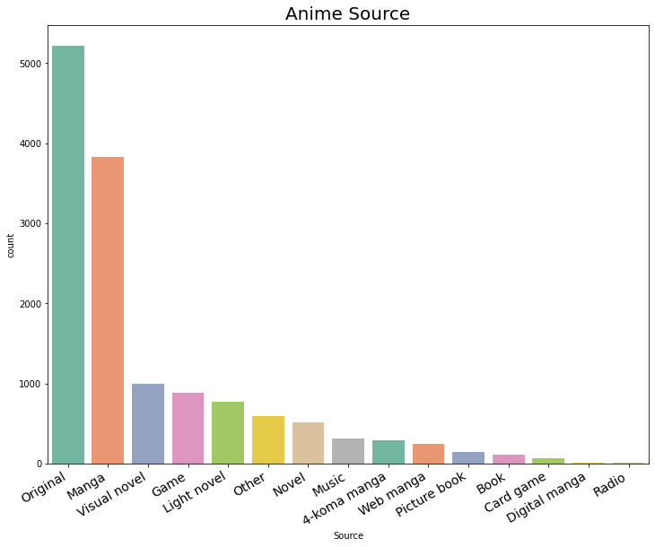</p>

<br/>

### **Rating (age rating) of Anime**
Rating represent age rating (PG, G, etc)
### Q: Was Anime a children show?
<p align="center">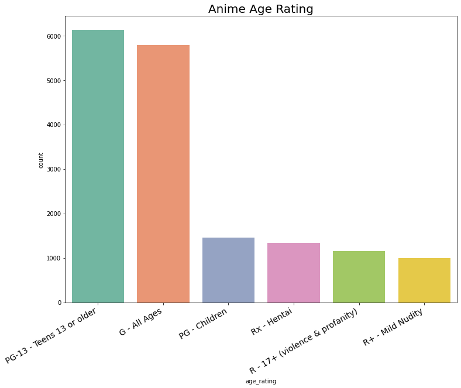</p>
Most anime rated PG-13, followed with All Ages. This makes most of anime marketed to teenager. 

PG-Children has a small number compared to other. This shown Anime was not completely a children show.
<br/>
<br/>

### **Anime 'Ranked' (position of anime rank in MAL)**
Ranked is rank Position based on Score
### Q: Whats the Top 10 Ranked Anime and its Score?
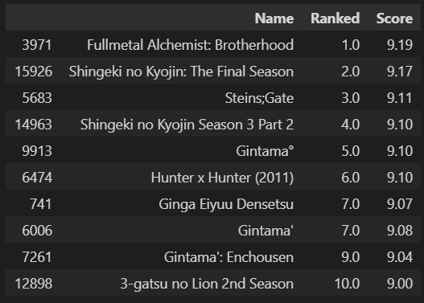
<br/>
<br/>

### **Anime's Popularity, Favorites, Members**
Favorites and Members Score, sorted with Popularity rank:
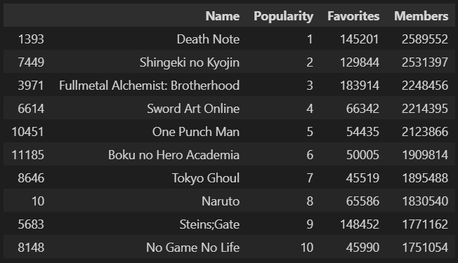

Top 1 anime based on popularity is Death Note. 

It's seems like popularity doesn't really correspond to its favorite because 'Steins;Gate' on rank 9 has larger favorites count than the rank 4-8. 

Members in other hand show corresponding number to popularity rank, since the higher the number, the higher the rank.

<br/>
Top Favorites and Members:
<p align="center">
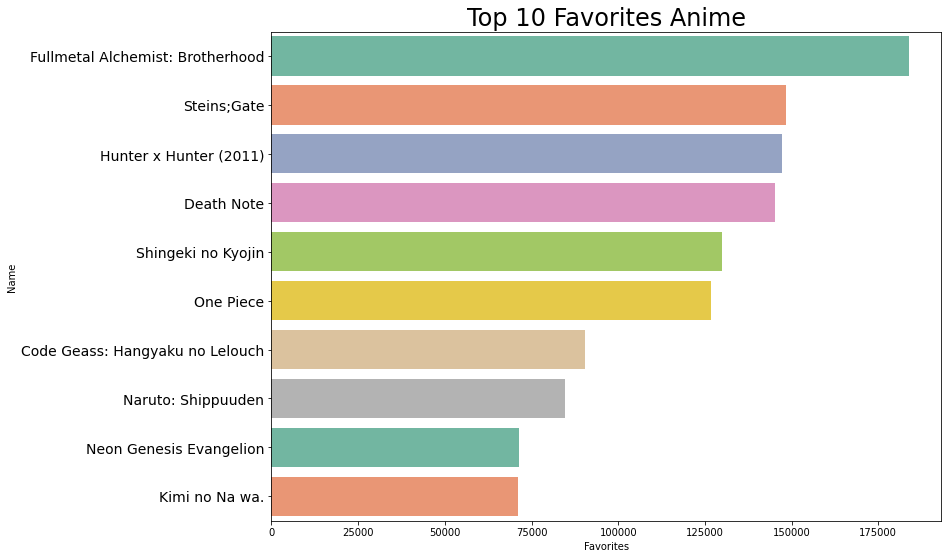
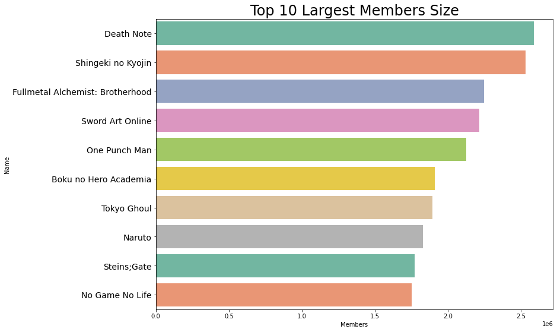
</p>
As we can see, 'Members' count correspond perfectly to 'Popularity'. This conclude 'Popularity' rank count comes from the members size.
<br/>
<br/>

### **user_rating (in rating_df)**
<p align="center">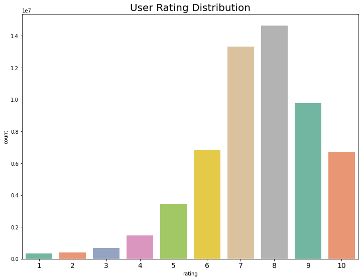</p>

<br/>

### Q: Whats the top 10 popular anime based on user_rating, is it the same as top 10 anime based on 'Ranked'?
we count the popularity by sum the total rating given by user to each anime.
<p align="center">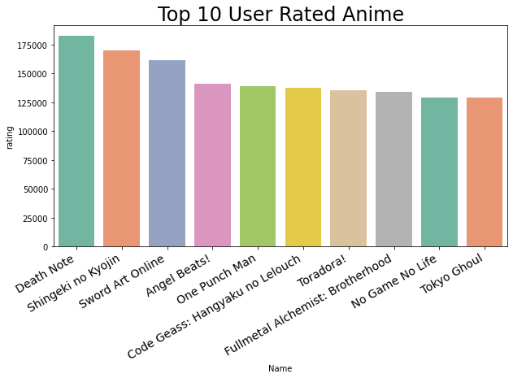</p>
We can see there are some different to the rank we get using 'Ranked' feature earlier. lets see the Score and Ranked for this ranking.

                                   Name  rating  Score  Ranked
    0                        Death Note  182375   8.63    60.0
    1                Shingeki no Kyojin  169794   8.48   115.0
    2                  Sword Art Online  161192   7.25  2584.0
    3                      Angel Beats!  141127   8.15   354.0
    4                     One Punch Man  138924   8.57    81.0
    5   Code Geass: Hangyaku no Lelouch  137291   8.72    39.0
    6                         Toradora!  135524   8.24   265.0
    7  Fullmetal Alchemist: Brotherhood  134197   9.19     1.0
    8                   No Game No Life  129009   8.20   304.0
    9                       Tokyo Ghoul  128822   7.81   807.0

The reasons of different rating and Ranked is the dataset on 'rating.csv' was only a part/subset of scrapped data from MAL. Meanwhile 'Ranked' on 'anime.csv' contain Ranked calculated from scores form all users by MAL. 

### Top 10 Anime 'Ranked' vs 'user_rating'

                         'user_rating'       'Ranked'
                                        
    1                        Death Note     Fullmetal Alchemist: Brotherhood
    2                Shingeki no Kyojin     Shingeki no Kyojin: The Final Season
    3                  Sword Art Online     Steins;Gate
    4                      Angel Beats!     Shingeki no Kyojin Season 3 Part 2
    5                     One Punch Man     Gintama°
    6   Code Geass: Hangyaku no Lelouch     Hunter x Hunter (2011)
    7                         Toradora!     Ginga Eiyuu Densetsu
    8  Fullmetal Alchemist: Brotherhood     Gintama'
    9                   No Game No Life     Gintama': Enchousen
    10                      Tokyo Ghoul     3-gatsu no Lion 2nd Season


## **MODEL RESULT AND CONCLUSION**
Table of Content:
- [Content-based Filtering Model](#content-based-filtering-model)
- [Collaborative Filtering Model](#collaborative-filtering-model)
- [Conclusion](#conclusion)

### Content-based vs Collaborative Filtering
<p align="center"></p>
Collaborative filtering is a recomender system that works by finding similar interest from other user. 

Meanwhile, Content-based filtering is a recommender system that works by finding similarity in the content of the anime that user likes(Genres, sypnopsis, etc).
<br/>
<br/>

### **CONTENT-BASED FILTERING MODEL**

*check jupyter [notebook](3_Content_based_filtering.ipynb) for this model*

<br/>

Content-based filtering is works by finding similarity (by computing pairwise similarity scores based on TF-IDF Matrix) in the content. 

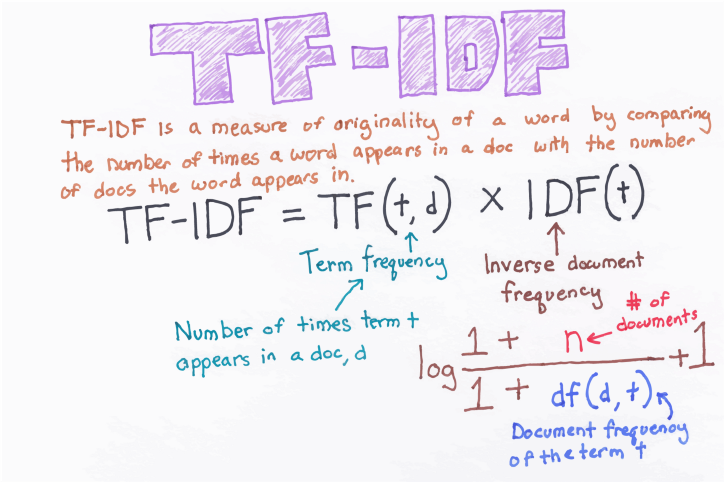


In this model, the content-based filtering recommender based on:
- sypnopsis based recommender
- Genres based recommender
- Studios based recommender

Lastly, the feature combined to create **1 combination recommender (making soup)** or one new feature with combination of feature.

### **CONTENT-BASED RECOMMENDER MODEL COMPARISION**
I tried to get recommender of "Haikyuu!!". For the record, Here are properties of "Haikyuu!!!"

    Titles      : Haikyuu!!
    Rating      : 8.53
    Genres      : "Comedy, Sports, Drama, School, Shounen"
    Type        : TV
    Studios     : Production I.G
    Source      : Manga
    Age Rating  : PG-13 - Teens 13 or older
    synopsis    : "Inspired after watching a volleyball ace nicknamed ""Little Giant"" in action, small-statured Shouyou Hinata revives the volleyball club at his middle school. The newly-formed team even makes it to a tournament; however, their first match turns out to be their last when they are brutally squashed by the ""King of the Court,"" Tobio Kageyama. Hinata vows to surpass Kageyama, and so after graduating from middle school, he joins Karasuno High School's volleyball team—only to find that his sworn rival, Kageyama, is now his teammate. Thanks to his short height, Hinata struggles to find his role on the team, even with his superior jumping power. Surprisingly, Kageyama has his own problems that only Hinata can help with, and learning to work together appears to be the only way for the team to be successful. Based on Haruichi Furudate's popular shounen manga of the same name, Haikyuu!! is an exhilarating and emotional sports comedy following two determined athletes as they attempt to patch a heated rivalry in order to make their high school volleyball team the best in Japan."

comparision:

**- sypnopsis based recommender**
    
    get_rec_content('Haikyuu!!', cosine_sim_sypnopsis)

    15199                     Haikyuu!!: To the Top
    9895                    Haikyuu!! Second Season
    2803                              Attacker You!
    3592                           Ashita e Attack!
    5654                         Attack No.1 (1970)
    13273                   Haikyuu!!: vs. "Akaten"
    1407                                Attack No.1
    4898     Shoujo Fight: Norainu-tachi no Odekake
    16296       2.43: Seiin Koukou Danshi Volley-bu
    9315                     Haikyuu!!: Lev Genzan!
    Name: Name, dtype: object

on sypnopsis recomender, we can see several similar titles with "Haikyuu!!" these are series/other season of Haikyuu!!. We also can see "Seiin Koukou Danshi Volley-bu", "Attack No.1", "Ashita e Attack!" was recommended. This because these of show have the theme of volleyball which may have similarities on the synopsis, esspecially on keyword "volleyball".  
<br/>

**- Genres based recommender**

    get_rec_content('Haikyuu!!', cosine_sim_genres)

    5633                                     Rokudenashi Blues
    7454                                         Batsu & Terry
    8305                                             Haikyuu!!
    9895                               Haikyuu!! Second Season
    10139                 Haikyuu!! Movie 1: Owari to Hajimari
    10495                 Haikyuu!! Movie 2: Shousha to Haisha
    11624    Haikyuu!!: Karasuno Koukou vs. Shiratorizawa G...
    12834                   Haikyuu!! Movie 3: Sainou to Sense
    12835                Haikyuu!! Movie 4: Concept no Tatakai
    14234                                        Ahiru no Sora
    Name: Name, dtype: object

In genres, we got a lot of "Haikyuu!!" series. "Rokudenashi Blues", "Batsu & Terry", "Ahiru no Sora" also get recommended as they have similarities of genre : Sports, Drama, School, Shounen.
<br/>
<br/>

**- Studios based recommender**

    get_rec_content('Haikyuu!!', cosine_sim_studios)

    93               Sakigake!! Cromartie Koukou
    128                                   Blood+
    178                            Video Girl Ai
    381                  Blood: The Last Vampire
    437        One Piece: Taose! Kaizoku Ganzack
    438    Koukaku Kidoutai: Stand Alone Complex
    439                                Innocence
    492                              Otogizoushi
    493               Boku no Chikyuu wo Mamotte
    535                                  Jin-Rou
    Name: Name, dtype: object

on studios recommender, there's no recommender of other Haikyuu!! series like other recommender did. Seems like studios-based recommender wasn't really good, especially for "Haikyuu!!" The reason I used Studios for recommendation is that several studios has strong characteristic and unique aspect of their anime, which makes some fan like other anime create by similar studio. 
<br/>
<br/>


**- content based recommender (combination of ['Genres', 'Type', 'Studios', 'Source', 'sypnopsis'])**

    get_rec_content('Haikyuu!!', cosine_sim_soup)

    15199                     Haikyuu!!: To the Top
    9895                    Haikyuu!! Second Season
    3592                           Ashita e Attack!
    2803                              Attacker You!
    13273                   Haikyuu!!: vs. "Akaten"
    5654                         Attack No.1 (1970)
    1407                                Attack No.1
    4898     Shoujo Fight: Norainu-tachi no Odekake
    16296       2.43: Seiin Koukou Danshi Volley-bu
    9315                     Haikyuu!!: Lev Genzan!
    Name: Name, dtype: object

this combination has simmilar recomendation with synopsis. I assume that since synopsis has longer word, it more likely to find simmilarities on word at synopsis
<br/>
<br/>

From the comparasion, we can see different feature give different recomendation.
<br/>
<br/>

### **So, which was the best Content-Based Recommender?**
In my opinion, these can differ to the anime titles. However, i think **combination** and **sypnopsis based recommender works the best**, followed by genres and studios based recommender.
<br/>
<br/>
<br/>


### **COLLABORATIVE FILTERING MODEL**
<!-- *check jupyter [notebook](3_Content_based_filtering.ipynb)
for this model* -->

*[Colaborative Filtering Model was still in process]*

<br/>

Collaborative filtering is a technique which find simmilarity of user's interest (on this case we will use factor of rating given by user)

To do this, we will used pivot table and apply cosine similarity to KNN.

</br>

**Pivot Table**
Pivot table is a table showing user interest to anime titles, this matrix will show user intrest for each anime titles by the rating it given. 
this pivot table will have columns of 'user_id', row of 'Name', and values of 'user_rating' from merged dataframe of anime_titles and user_rating

<p align="center">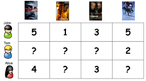</p>

<br/>

### **CONCLUSION**

In this project we've build recommender system with Content-based and Collaborative Filtering. Each recommender system has its own advantages and limitation. Some apporach to optimize this model is by finding better parameter that effect the recommender system. 

Lastly, in the future, I hope to be able to deploy this recommender system to make the model interactive, for example a simple anime recommender website with search option, etc.   

[scroll up](#anime-recommender-system)